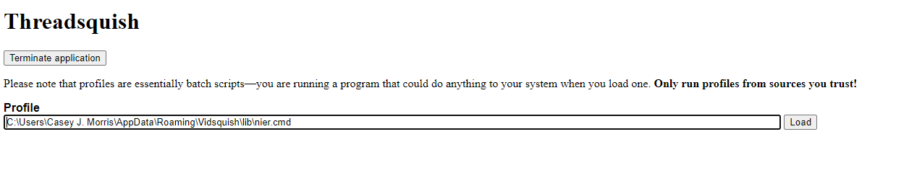
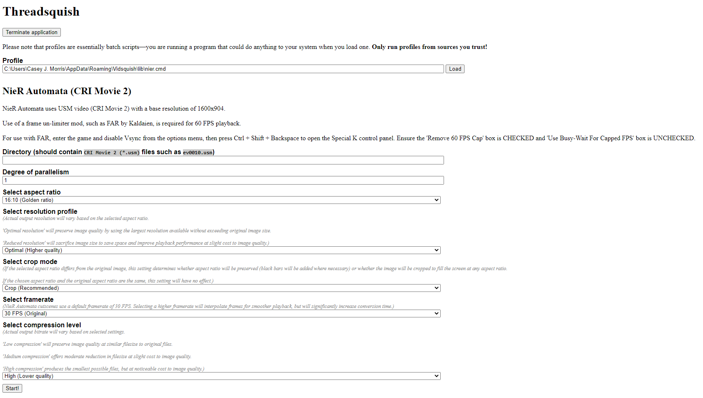
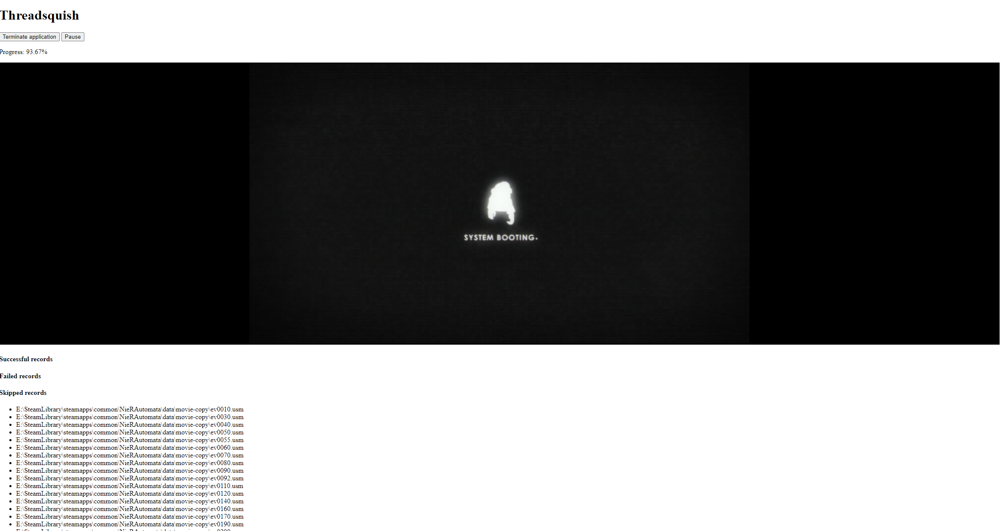

# Threadsquish

Threadsquish is a simple, multi-threaded runner of [Vidsquish](https://lucasc.me/post/vidsquish) profiles (which are,
in turn, Windows batch scripts crossed with INI files, allowing a GUI to be provided for them).

While it lacks the refined and skinnable interface of Vidsquish, it does have the ability to fully saturate your
multi-threaded CPU.

## Setup and use

Since the profiles do not have any license that I am aware of, I am not distributing any of them with this package.
You will still need to download [Vidsquish](https://lucasc.me/post/vidsquish) to get them (or otherwise provide your
own).  Additionally, any programs referenced in the profile you want to run will either need to be on your system
PATH or be in the same directory as the profile itself (if you have ever run Vidsquish, you can find all the 
depedencies its scripts use in `%APPDATA%\Vidsquish\lib`).

Threadsquish is built as a Web service that runs locally on your machine (but is accessible only to you).  
When you start `threadsquish.exe`, your Web browser should open and go to http://localhost:9090 (but if not you can 
type this address into your Web browser). 
 
 From here, you will be prompted to select a profile&mdash;enter the full path of your profile (i.e., starting
 from the drive letter) and click "load."
 
 
 
 This will cause the profile to be parsed and you will be prompted to fill in options.  "Directory" refers to the folder
 on your hard disk where the movies to be processed are stored.  Note that Vidsquish profiles are generally
 destructive&mdash;so it may be wise to operate on a copy of the original folder.  "Degree of parallelism" refers
 to the number of workers that will simultaneously process files.  If you want to fully saturate your CPU, just enter
 the number of threads it can support.  If you'd like to actually use your computer while the process goes on,
 using half the available threads might be a good compromise.  You can experiment and find what balance you're happy
 with.  Other options are profile-dependent and may include some explanation.
 
 
 
 Once you click the button labeled "Start!", the screen will transition to the in-progress screen, which will
 report progress percentage, show a preview image (if available), and so on.
 
 
 
 If you would like to stop the operation and come back later, clicking the "Pause" button will finish whichever
 files are already in progress and skip the rest.  Your progress will be saved in a file called `_THREADSQUISH.TXT`
 in the movie directory, so the same files you already processed will be skipped if you start again (your options are
 not saved, though, so you will need to enter them again).
 
 The program does not really have a well-developed resume function at present, so the best way to resume is to terminate
 the application and start it again.
 